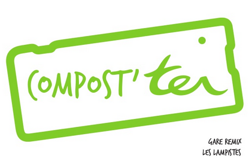
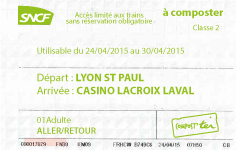
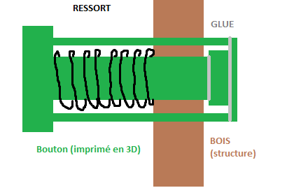

Compos'TER - prototype de service réalisé durant [Gare Remix](http://garemixsaintpaul.grandlyon.com/) 2015.

Plus d'infos sur compos'TER : [page de l'équipe Lampiste](http://garemixsaintpaul.grandlyon.com/index.php/les-lampistes).

*A few elements in approximate english can be read below.*

## Contexte et problématique

Le projet Compos’Ter propose aux riverains et aux usagers de gagner des billets de tram-train à destination de l’Ouest-Lyonnais, en échange de leurs déchets (compost et déchets plastiques). Le compost servira ensuite à végétaliser la gare et ses alentours. Les déchets plastiques seront quant à eux recyclés en mobilier d’extérieur par des associations pour faire vivre autrement le parvis de la gare. Le projet Compos’Ter vise ainsi à reconnecter les deux territoires de Lyon et de l’Ouest-Lyonnais et à créer un lieu d’échange au sein de la gare, tout en améliorant l’équilibre environnemental dans le quartier.

***Approximate English :***
*Compost'TER is a 3-day-built project created during the event Garemix, aiming to innovate and invent new services in Lyon Saint Paul train station. Compost'TER is an interactive compost an recycle bin, fostering the touristic development of the area served by the station, and creating social link in the district. Compost'TER was led by a 5 people team and mixes arduino, web application, wood and cardboard (and many other things). More info on [Garemix website](http://garemixsaintpaul.grandlyon.com/index.php/les-lampistes/).*

## Notre création

### Description générale

Le prototype est composé de :
- **le composteur** : structure en bois comportant deux bacs de réception de déchet et servant de support à un écran, interface avec l'utilisateur.
- **l'arbre** : découpe en carton d'un arbre majestueux, dont les branches sont augmentées de **rubans de leds** s'allumant au fur et à mesure que des déchets sont jetés (l'arbre pousse !).
- un **écran** avec une résolution de 1920 x 1080 px, connecté à un ordinateur hébergeant le code de l'application web, permettant de lancer l'application
- un **bouton poussoir** permettant de lancer le jeu (momentary switch arduino)
- un **capteur** permettant de détecter le laché de déchet dans le composteur

Le bouton poussoir et le capteur détectent les déchets et envoient des signaux à l'application web, laquelle pilote en fonction l'affichage de l'écran.

### Informatique

La partie application web est réalisée à partir du framework Meteor.js (javascript).

Le code est à diposition dans le dossier [WebApplication](WebApplication), et plus d'informations sur l'installation et le fonctionnement figurent dans le [read.me](WebApplication/readme.md) à sa racine.

### Electronique
- 1 carte Arduino Uno
- 3 breadboards ( 1 pour les relais, 1 déporté pour le capteur de distance, 1 déporté pour le bouton permettant de lancer le jeu)
- 1 capteur de distance
- 4 bandeaux de LEDs (entrée de gamme suffit) avec transformateur 12V
- 4 relais 12-220V
- 1 résistance 10 kOhm
- 1 momentary switch
- Quelques fils électriques

## Le montage
### La structure
...

###Le bouton pour jouer

### Electronique
Connectez impérativement la carte en USB puisqu'il y a envoi d'informations à l'application web par le Serial.

## L'équipe

- Thomas BUISSON, expert du quotidien
- Claire ZULIANI, bricoleuse numérique ([site web](http://www.clairezuliani.com/))
- Sarah BLONDE, urbanophile
- Benjamin COHEN, joker
- Lydiane BONNET, facilitatrice

