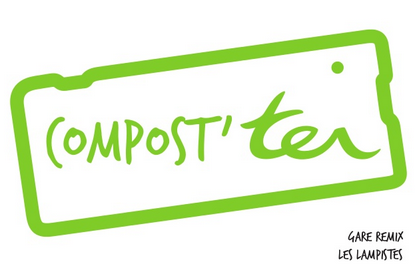
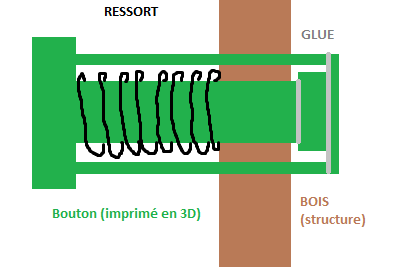
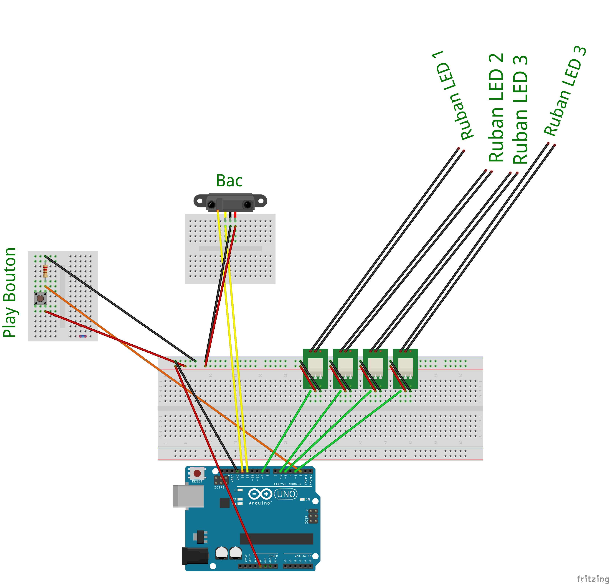
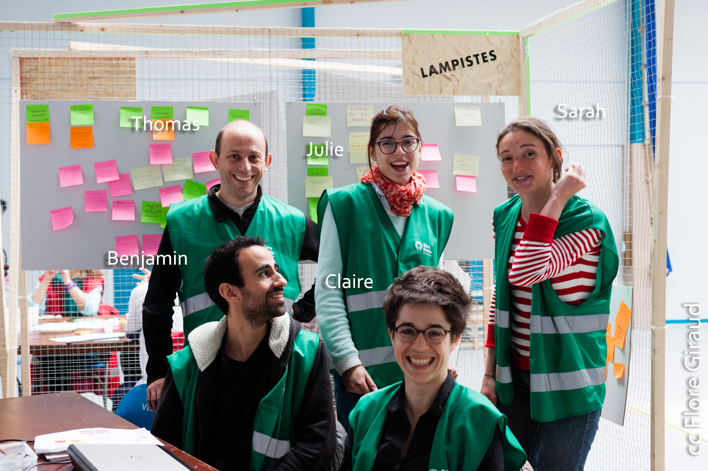

Compos'TER - Gare Remix 2015 Project - Green Team ( Les lampistes : http://garemixsaintpaul.grandlyon.com/index.php/les-lampistes/ )

## Contexte et problématique
Blablablablabla  Gare Remix
blabla des déchets, pas de vie de quartier, pas de connaissance sur les attractions touristiques

## Notre création

descriptif rapide

## Matériels requis
### Matériaux
bois, ... , pince à dénuder, vis, colle, ...

### Informatique
Ruby, config mini, ..

### Electronique
- 1 carte Arduino Uno
- 3 breadboards ( 1 pour les relais, 1 déporté pour le capteur de distance, 1 déporté pour le bouton permettant de lancer le jeu)
- 1 capteur de distance
- 4 bandeaux de LEDs (entrée de gamme suffit) avec transformateur 12V
- 4 relais 12-220V
- 1 résistance 10 kOhm
- 1 momentary switch
- Quelques fils éléctriques

## Le montage
### La structure
...

###Le bouton pour jouer

### Electronique
Connectez impérativement la carte en USB puisqu'il y a envoi d'informations au programme Ruby par le Serial.

## L'équipe

Pour nous contacter, ... ?
